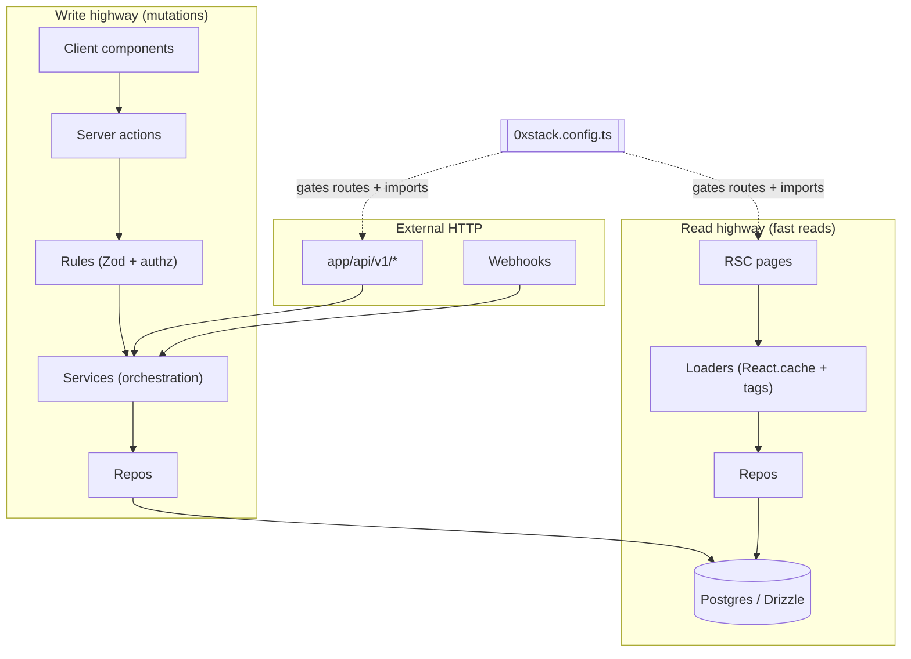
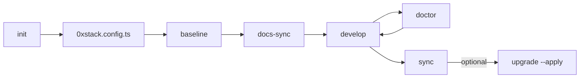

<p align="center">
  
</p>

<h1 align="center">
  0xstack
</h1>

<p align="center">
  <strong>Production CQRS Architecture system for Next.js | PostgreSQL | Drizzle | Better Auth | TanStack Query</strong>
</p>

<p align="center">
  <strong>0xstack</strong> (npm: <code>0xstack</code>) is a <strong>self-healing architecture engine</strong> for <strong>SaaS</strong> and internal apps: <strong>React Server Components</strong>, <strong>Server Actions</strong>, <strong>TanStack Query</strong> on the client, <strong>Drizzle ORM</strong> + <strong>Postgres</strong> (Supabase-friendly), and <strong>Better Auth</strong>.
</p>

<p align="center">
  <a href="#-what-is-0xstack"><strong>What it is</strong></a> ·
  <a href="#architecture"><strong>Architecture</strong></a> ·
  <a href="#getting-started"><strong>Get Started</strong></a> ·
  <a href="#the-saas-starter-landscape"><strong>Landscape</strong></a>
</p>

---

## 🚀 What is 0xstack?

**0xstack = Production architecture system for Next.js**

- **📐 Read/Write separation** — Two highways: fast reads (loaders) + safe writes (actions → rules → repos)
- **🛡️ Enforced boundaries** — ESLint + `doctor` prevent architecture drift
- **🔧 CLI that keeps your repo correct** — `baseline`, `sync`, `upgrade` auto-heal your codebase over time

```bash
# Start a new project in 2 minutes
npx 0xstack@latest init

# Install full production baseline (idempotent)
npx 0xstack baseline --profile full

# Validate architecture, deps, and env
npx 0xstack doctor

# Reconcile repo with config (plan or apply)
npx 0xstack sync --apply
```

> [!IMPORTANT]
> **Do NOT install this package with `npm i 0xstack`.** 
> 0xstack is a project initializer. Installing it as a dependency will only give you a `node_modules` folder and a `package.json`.
>
> To start a new project, use:
> ```bash
> npx 0xstack@latest init
> ```

> [!WARNING]
> **Experimental Stage**: 0xstack is currently in an experimental stage. Implementation details and APIs may change. Use with caution in critical environments. Found a bug? [Report it here](https://github.com/0xmilord/0xstack/issues) and help us build!

---

<div align="center">

[![NPM version][npm-image]][npm-url] [![Downloads][downloads-image]][npm-url] [![License][license-image]][license-url] [![PRs Welcome][contribute-image]][contribute-url]

</div>

## Table of contents

- [What is 0xstack?](#-what-is-0xstack)
- [Architecture](#architecture)
- [Naming: 0xstack vs oxstack](#naming-0xstack-vs-oxstack)
- [Who is this for?](#who-is-this-for)
- [The SaaS Starter Landscape](#the-saas-starter-landscape)
- [Frequently asked questions](#frequently-asked-questions)
- [What you need vs optional](#what-you-need-vs-optional)
- [Modules (capabilities)](#modules-capabilities)
- [CLI commands](#cli-commands)
- [Configuration](#configuration)
- [Getting started](#getting-started)
- [Release process](#release-process)
- [Contributing](#contributing)

## Architecture



**CLI and repo hygiene loop:**



### Layer definitions

| Layer | Purpose | Rules |
|-------|---------|-------|
| **Repos** | Data access only | No business logic, no imports from UI |
| **Loaders** | Read-only facades | Use `React.cache()`, shape output for viewer/public |
| **Rules** | Business rules for writes | Authz + invariants + validation glue |
| **Services** | Orchestration only | Multi-step flows, transactions, integrations |
| **Server actions** | Internal API for the app | Call `requireAuth()`, validate with Zod, trigger revalidation |
| **API routes** | External only | Call same rules/services as actions |
| **Client hooks** | Transport + cache | TanStack Query only, no business logic |

---

## Naming: 0xstack vs oxstack

The project name is **0xstack** ( **`0xstack`** on npm ) — a leading **zero**, not the letter **o**. Common web search typo: **oxstack**. This section uses both spellings so search engines and readers land in the right place.

## Who is this for?

0xstack fits teams that want:

- A **typed Next.js App Router** codebase with **Zod** validation and a **clear CQRS-style split** (loaders vs actions vs repos).
- **TanStack Query** for **client-side cache and mutations** without putting business logic in hooks.
- **Drizzle** instead of Prisma, and **Better Auth** instead of legacy NextAuth-only patterns.
- **Supabase Postgres** (or any Postgres) with migrations and **optional** modules: **billing** (Dodo or Stripe), **object storage** (GCS, S3, or Supabase Storage), **MDX blog**, **SEO** metadata routes, **PWA**, **observability** stubs.
- A **repeatable operator CLI** (`doctor`, `sync`, `generate`, `add`) comparable in spirit to a **framework for your repo** — closer to a **managed starter** than a one-shot template unzip.

## The SaaS Starter Landscape

This table is a **high-level tradeoff guide**, helping you choose the right tool for your project requirements.

| Topic | **One-shot Templates** (ShipFast, etc.) | **Component-First** (Shadcn/UI starters) | **0xstack** (The Architecture Engine) |
|------|------------------------------|-------------------------------------|--------------|
| **Core Value** | Speed of initial setup (Zip/Git clone) | Great UI out of the box | **Long-term architecture integrity** |
| **Lifecycle** | "Generating" is the end of the tool's job | Manual updates and maintenance | **Continuous sync, doctor, and baseline** |
| **Architecture** | Often a "flat" structure | Often UI-component centric | **Strict CQRS (Loaders vs. Actions vs. Repos)** |
| **After Day 30** | You own a large, drifted codebase | Manually keeping up with UI updates | **CLI helps reconcile code with config** |
| **AI Experience** | AI can easily break the "flat" layers | AI generates components well | **AI is constrained by architectural rules** |

**When 0xstack is the right fit:** You are building a serious SaaS or internal tool and want a **factory CLI** that keeps **docs, deps, and boundaries** aligned with your config as you grow.

---

## Frequently asked questions

Discovery-oriented answers (T3 Stack, TanStack Query starter, Supabase Drizzle, npm package):

**Is 0xstack a starter or a framework?**  
It is an **Architecture Engine**. Unlike a standard starter that you clone once, 0xstack stays with your project. You use the CLI to sync dependencies and enforce boundaries throughout the app's life.

**Is this a TanStack starter?**  
It is a **TanStack Query–friendly Next.js starter**: generated apps include **TanStack Query** for client data fetching and cache invalidation; routing and server data use **RSC** and **loaders** per the “two highways” model.

**Supabase Drizzle starter — is Supabase required?**  
Any **Postgres** works with **`DATABASE_URL`**. Docs and examples often mention **Supabase** because it is a common host for managed Postgres.

**Next.js server actions starter with architecture enforcement?**  
Yes: generated apps prefer **Server Actions** for writes, **`lib/rules`** + **`lib/services`** + **`lib/repos`**, and **`doctor`** checks for common boundary mistakes.

**npm package name?**  
**`0xstack`** — search **“0xstack npm”** to install.

## What is 0xstack?

0xstack is a **starter system** (not just a template):

- **Scaffold** a new app via `init` (interactive wizard or flags for CI)
- **Install and activate** capabilities via `baseline` (driven by `0xstack.config.ts` + profile)
- **Validate** env, dependencies, and layer boundaries via `doctor` (add `--strict` for extra PRD hygiene)
- **Reconcile** the repo over time via `sync` (plan by default; `--apply` runs baseline + docs, optional lint/format/drizzle)
- **Progressive activation**: **installed ≠ activated** — heavy SDKs and routes stay off until a module is enabled in config

The generated app uses two entry points:

| Surface | Use |
|--------|-----|
| **Internal (RSC + server actions)** | Product UI: reads via loaders, writes via actions → rules → services → repos |
| **External (`/api/v1/*`)** | Clients, webhooks, cron: stable HTTP routes that reuse the same services/rules |

Billing and storage can be wired to **Dodo** or **Stripe**, and **GCS**, **S3**, or **Supabase Storage**, depending on config.

## Generated app architecture

High-level data flow in a 0xstack app:


CLI and repo hygiene loop:


## What you need vs optional

### You need

| Requirement | Why |
|-------------|-----|
| **Node.js** (LTS recommended) | CLI + Next.js |
| **npm, pnpm, yarn, or bun** | Install deps; CLI detects lockfiles where relevant |
| **A Postgres database** | Drizzle ORM; docs assume **Supabase** URLs but any Postgres works if `DATABASE_URL` is set |
| **Better Auth–compatible env** | `BETTER_AUTH_SECRET`, `BETTER_AUTH_URL`, session cookies — see generated `.env.example` |

### You do not need on day one

These are **optional modules** (off until enabled in config):

- **Billing** (Dodo or Stripe) and their API keys
- **Object storage** (GCS, S3, or Supabase Storage) and bucket credentials
- **Resend** for transactional email
- **SEO / MDX blog** if you ship a minimal internal app first
- **PWA**, **Sentry**, **OpenTelemetry**, **background jobs** stubs

Run `npx 0xstack doctor` after enabling a module to see missing deps, files, and env keys for that profile.

## Modules (capabilities)

Activation is controlled only through **`0xstack.config.ts`** (`modules` + **`profiles`** like **`core`** / **`full`**). The CLI is built from smaller internal pieces (for example billing core + Dodo or Stripe provider), but you only choose the knobs below.

| `modules` key | When enabled | When off |
|---------------|--------------|----------|
| **`auth`** | Always **`better-auth`** in v1: Drizzle adapter, sessions, auth routes | N/A (fixed) |
| **`orgs`** | Multi-tenant baseline: orgs, membership, org-scoped actions/loaders | Rarely turned off; default presets expect orgs for the app shell |
| **`billing`** | **`dodo`** or **`stripe`**: checkout, portal, webhooks, DB subscription state, `getBillingService()` via factories | **`false`**: no billing API routes or heavy billing imports |
| **`storage`** | **`gcs`**, **`s3`**, or **`supabase`**: signed uploads, assets table, `getStorageService()` | **`false`**: no storage API routes |
| **`email`** | **`resend`**: verify/reset email templates + hooks | **`false`**: no Resend wiring |
| **`cache`** | LRU + tag helpers for RSC | Can disable with **`--no-cache`** on init |
| **`pwa`** | Manifest, SW stub, push scaffolding | No PWA routes or public SW assets |
| **`seo`** | `robots.ts`, `sitemap.ts`, JSON-LD, OG routes, **`getSeoConfig()`** | Those routes/helpers removed |
| **`blogMdx`** | `content/blog`, MDX, blog + RSS | No blog or RSS routes |
| **`observability`** | **`sentry`** / **`otel`** flags install and scaffold instrumentation | Off: lighter deps |
| **`jobs`** | **`enabled`**: reconcile/cron-style API stub for async work | **`enabled: false`**: stub routes absent |

Baseline also wires **security** (proxy, headers, API guards), **webhook ledger** (when billing needs idempotency), and **UI foundation** (shells, marketing pages) so the app matches the PRD shape.

Enable combinations with **`init`** flags, **`wizard`**, **`add <module>`** (see **`0xstack modules`**), or by editing config and running **`baseline`**.

**Progressive factories** (after baseline): **`lib/services/module-factories.ts`** exposes **`getBillingService()`**, **`getStorageService()`**, and **`getSeoConfig()`** so you do not statically import disabled stacks.

## CLI commands

All commands support **`--dir <path>`** where noted (default: current working directory). Package ID on npm is **`0xstack`**; examples use `npx` — use `pnpm dlx` / `yarn dlx` / `bunx` equivalently.

### Lifecycle

| Command | Purpose |
|---------|---------|
| **`init`** | Create Next.js app + 0xstack layout; progressive TUI or **`--yes`** + module flags (`--billing`, `--storage`, `--seo`, `--blog`, `--email`, `--pwa`, `--jobs`, `--sentry`, `--otel`, `--no-cache`, `--pm`, `--name`, `--theme`, `--interactive`) |
| **`baseline`** | Idempotent install: deps, Better Auth schema gen, Drizzle migrations pipeline, **module lifecycle** (install → activate → **consolidated validate** → per-module validate/sync), docs refresh, key indexes **`--profile core|full`**, **`--pm`** |
| **`sync`** | **Plan** deps drift + disabled-module leftovers; **`--apply`** runs baseline + **docs-sync**. Optional **`--lint`**, **`--format`**, **`--drizzle-generate`** (with `--apply`). **`--profile`**, **`--pm`** |
| **`upgrade`** | **Plan** or **`--apply`**: refresh PRD hygiene (config keys, runtime Zod schema, ESLint boundaries file, module factories, Vitest stub) without full codemods |
| **`doctor`** | Env schema keys, deps for enabled modules, file presence, import boundaries, migrations hints. **`--strict`**: also fail on missing generated-domain tests, ESLint boundary bundle, module factories |

### Generators and modules

| Command | Purpose |
|---------|---------|
| **`generate <domain>`** | Schema slice, repo, service, loader, rules, actions, query/mutation keys, hooks (if **`--with-api`**), UI page stub, optional **`/api/v1/<plural>`**, minimal **Vitest** tests under `tests/<plural>/` |
| **`add <module>`** | Enable a module in config and run baseline (ids: **`0xstack modules`**) |
| **`modules`** | Print installable module ids for **`add`** |

### Config and insight

| Command | Purpose |
|---------|---------|
| **`config-print`** | Resolved **JSON** after profile merge **`--profile`** |
| **`config-validate`** | Zod validation of **`0xstack.config.ts`** |
| **`deps`** | Expected **app** deps from config; **`--cli`** lists this CLI’s deps |
| **`wizard`** | Interactive reconfiguration + baseline **`--profile`**, **`--pm`** |

### Docs and vendor CLIs

| Command | Purpose |
|---------|---------|
| **`docs-sync`** (alias **`docs:sync`**) | Regenerate marker-backed docs (`--profile`) |
| **`shadcn [...args]`** | Passthrough **`shadcn@latest`** |
| **`auth [...args]`** | Passthrough **`auth@latest`** (Better Auth CLI) |
| **`drizzle [...args]`** | **`drizzle-kit`** via local package manager |
| **`wrap`** | Short help for wrappers and operator helpers |

### Git and release

| Command | Purpose |
|---------|---------|
| **`git init`** | `git init` in project dir |
| **`git status`** | `git status` |
| **`git commit`** | Prompted **Conventional Commit** (type / scope / subject) or **`-m` / `--message`** |
| **`release`** | If **`.changeset`** exists, runs **`npx @changesets/cli status`**; otherwise prints adoption hints |

## Configuration

- Primary file: **`0xstack.config.ts`** using **`defineConfig`** from **`lib/0xstack/config.ts`**
- **Profiles** (e.g. **`core`**, **`full`**) patch **`modules`** for repeatable presets
- **`baseline`** / **`sync --apply`** / **`wizard`** read this file; **`doctor`** / **`sync`** validate it

## Getting started

This package is published to **npm**, and works with **npm / pnpm / yarn / bun**.

### npm

```bash
npx 0xstack init
```

### pnpm

```bash
pnpm dlx 0xstack init
```

### yarn

```bash
yarn dlx 0xstack init
```

### bun

```bash
bunx 0xstack init
```

Typical flow after init:

```bash
npx 0xstack baseline --profile full
cp .env.example .env.local
npx 0xstack doctor --profile full
pnpm dev
```

## 🎯 Why 0xstack for Vibecoders & AI-First Devs

If you are a **"vibecoder"**—someone who flows with creativity, experiments fast, and leans on **AI-assisted development** (Cursor, GitHub Copilot, or AI Agents)—0xstack is designed to be your best friend.

When you're generating code with AI at 100mph, you need a framework that acts as a **mentor**, ensuring that even your most "vibey" sessions result in a scalable, production-ready codebase.

### 🚀 Why it vibes with AI-assisted dev:
- **Guardrail Architecture**: CQRS (Reads/Writes separation) enforces discipline automatically. If you drop AI-generated logic into the repo, the framework nudges you to put it in the right layer (Rules vs. Services vs. Repos).
- **AI Synergy**: AI agents perform better when they have clear boundaries. 0xstack's strict folder structure and `doctor` command ensure that AI-generated boilerplate fits into a predictable, robust pattern.
- **No "Rewrite Wall"**: Most "fast" prototypes hit a wall and need a complete rewrite at 10k users. with 0xstack, you prototype *and* build for scale simultaneously. You don't have to choose between speed and stability.
- **Self-Healing Loop**: Use **`baseline`**, **`sync`**, and **`doctor`** to auto-reconcile your repo. If your AI coding session drifts too far, the CLI helps pull the architecture back into alignment.

### 🧭 The Paradigm Difference
- **One-shot Boilerplates**: Great for a weekend project where you want to hack something together and ship.
- **0xstack**: Great for devs who want to build a serious SaaS that stays clean, secure, and professional as it grows.


---

[downloads-image]: https://img.shields.io/npm/dm/0xstack
[npm-url]: https://www.npmjs.com/package/0xstack
[npm-image]: https://img.shields.io/npm/v/0xstack
[license-url]: ./LICENSE
[license-image]: https://img.shields.io/npm/l/0xstack
[contribute-url]: ./CONTRIBUTING.md
[contribute-image]: https://img.shields.io/badge/PRs-welcome-blue.svg
